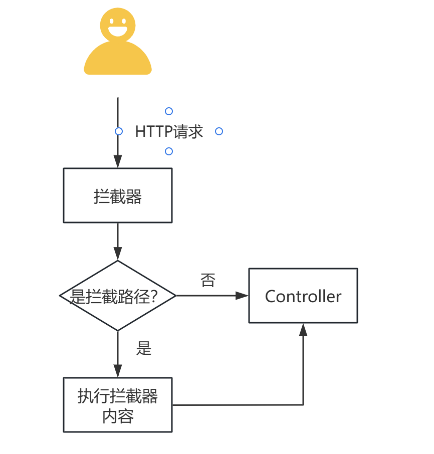

# JWTDemo

## 简介
JWTDemo 是一个用于演示如何使用 JSON Web Token (JWT) 的示例项目。该项目展示了如何生成、验证和使用 JWT 进行身份验证。

## 特性
- 生成 JWT
- 验证 JWT
- 使用 JWT 进行身份验证

## 安装
1. 确保你已经安装了 Java 开发环境 (JDK)。
2. 克隆项目到本地：
   ```bash
   git clone https://github.com/yourusername/JWTDemo.git
## 实现步骤
1. 自定义拦截器，拦截器name implements HandlerInterceptor；
2. 定义配置类，配置类name implements WebMvcConfigurer；
3. 在配置类中注册拦截器，并指定拦截的url和放行的url；
4. 拦截器生效会拦截Controller的请求；
5. 不要在自定义拦截器中使用@Slf4j,会导致拦截器失效。

## 具体流程
启动SpringBootApplication-->拦截器注册-->
拦截器拦截Controller-->
Controller执行-->拦截器结束


